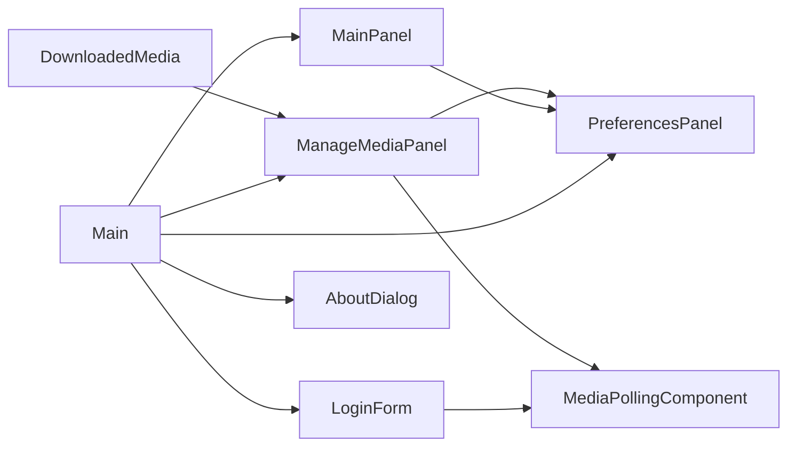
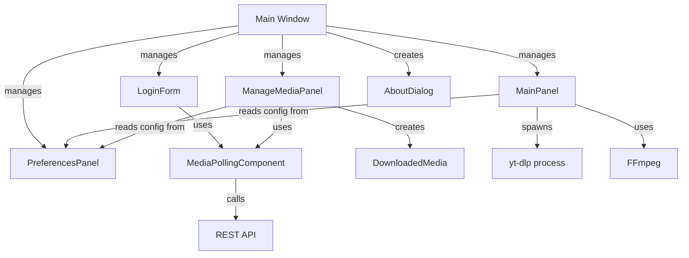

## Component Overview

MegaDownloader consists of several core components, each with specific responsibilities in the application architecture.



## Main Window Manager

### Main.java

**Location**: `Main.java:29`

**Responsibilities**:
- Application window management
- Panel navigation using CardLayout
- Media polling service coordination
- Custom window dragging for undecorated frame
- FlatLaf Darcula theme setup

<Accordion title="Key Features">
  - **Panel Management**: Manages all application panels (Login, Main, Preferences, Media)
  - **Navigation State**: Tracks current and previous panel for back button functionality
  - **Dependency Injection**: Connects panels with shared services
  - **Auto-login**: Checks for saved credentials on startup
  - **Configuration Check**: Validates yt-dlp configuration on launch
</Accordion>

**Navigation Methods**:

```java
public void showMainPanel() {
    previousPanel = currentPanel;
    currentPanel = "MAIN";
    cardLayout.show(cardPanel, "MAIN");
}

public void showPreferencesPanel() {
    previousPanel = currentPanel;
    currentPanel = "PREFERENCES";
    cardLayout.show(cardPanel, "PREFERENCES");
}

public void goBack() {
    cardLayout.show(cardPanel, previousPanel);
    currentPanel = previousPanel;
}

public void logout() {
    loginForm.clearToken();
    showLoginForm();
}
```

**Window Dragging Implementation** (`Main.java:139`):

```java
private void enableDragging(Component component) {
    component.addMouseListener(new MouseAdapter() {
        @Override
        public void mousePressed(MouseEvent e) {
            initialClick = e.getPoint();
        }
    });

    component.addMouseMotionListener(new MouseMotionAdapter() {
        @Override
        public void mouseDragged(MouseEvent e) {
            int thisX = Main.this.getLocation().x;
            int thisY = Main.this.getLocation().y;
            int xMoved = e.getX() - initialClick.x;
            int yMoved = e.getY() - initialClick.y;
            Main.this.setLocation(thisX + xMoved, thisY + yMoved);
        }
    });
}
```

<Note>
The `enableDragging()` method is applied to the content pane, menu bar, and media polling component to allow window movement.
</Note>

---

## Download Interface

### MainPanel.java

**Location**: `MainPanel.java:30`

**Responsibilities**:
- URL input and validation
- yt-dlp process execution
- Download progress monitoring
- Audio/video format selection
- Custom arguments support
- M3U playlist generation
- Integration with FFmpeg for audio extraction

<Accordion title="Key Features">
  - **Process Execution**: Spawns yt-dlp subprocess with ProcessBuilder
  - **Progress Parsing**: Real-time progress bar updates from yt-dlp output
  - **FFmpeg Integration**: Auto-detects FFmpeg in yt-dlp directory
  - **Speed Limiting**: Applies download speed limits from preferences
  - **Playlist Support**: Creates M3U playlists for downloaded media
  - **File Tracking**: Opens downloaded files with system default player
</Accordion>

**Download Process** (`MainPanel.java:481`):

```java
SwingWorker<Integer, Integer> worker = new SwingWorker<Integer, Integer>() {
    @Override
    protected Integer doInBackground() throws Exception {
        List<String> command = new ArrayList<>();
        command.add(ytdlpPath);
        
        if (ffmpegLocation != null) {
            command.add("--ffmpeg-location");
            command.add(ffmpegLocation);
        }
        
        if (limiterEnabled) {
            command.add("--limit-rate");
            command.add(speedLimitKBps + "K");
        }
        
        if (audioOnly) {
            command.add("-x");
            command.add("--audio-format");
            command.add("mp3");
        }
        
        command.add(url);
        
        ProcessBuilder pb = new ProcessBuilder(command);
        Process process = pb.start();
        
        // Parse output for progress updates
        return process.waitFor();
    }
};
```

**Configuration Loading** (`MainPanel.java:174`):

```java
private String getYtDlpPath() {
    File configFile = new File("config.txt");
    try (BufferedReader reader = new BufferedReader(new FileReader(configFile))) {
        String line;
        while ((line = reader.readLine()) != null) {
            if (line.startsWith("path:\"") && line.endsWith("\"")) {
                return line.substring(6, line.length() - 1);
            }
        }
    }
    return null;
}
```

---

## Authentication

### LoginForm.java

**Location**: `LoginForm.java:44`

**Responsibilities**:
- User authentication via API
- Credential validation (email format, password)
- Session persistence with Java Preferences API
- Auto-login on startup
- Token management

<Accordion title="Key Features">
  - **Email Validation**: Real-time regex-based email validation
  - **Visual Feedback**: Red border on invalid input
  - **Remember Me**: Stores credentials using Preferences API
  - **Auto-login**: Validates saved tokens on startup
  - **API Integration**: Uses MediaPollingComponent for authentication
</Accordion>

**Email Validation** (`LoginForm.java:176`):

```java
private boolean validateEmail() {
    String email = txtEmail.getText();
    Pattern pattern = Pattern.compile("^[\\w.-]+@[\\w.-]+\\.[a-zA-Z]{2,}$");
    if (!pattern.matcher(email).matches()) {
        txtEmail.setBorder(BorderFactory.createLineBorder(new Color(220, 53, 69)));
        return false;
    }
    txtEmail.setBorder(defaultBorder);
    return true;
}
```

**Token Persistence** (`LoginForm.java:247`):

```java
private void saveToken(String email, String token) {
    prefs.put("auth_token", token);
    prefs.put("user_email", email);
}

public boolean checkAutoLogin() {
    String savedToken = prefs.get("auth_token", null);
    String savedEmail = prefs.get("user_email", null);
    
    if (savedToken != null && savedEmail != null) {
        if (mediaPollingComponent.checkToken(savedToken)) {
            this.token = savedToken;
            mediaPollingComponent.setToken(savedToken);
            return true;
        } else {
            clearToken();
        }
    }
    return false;
}
```

---

## Media Management

### ManageMediaPanel.java

**Location**: `ManageMediaPanel.java:39`

**Responsibilities**:
- Display local and server media files
- Search and filter functionality
- File operations (play, delete, download)
- Server synchronization
- Quick actions context menu

<Accordion title="Key Features">
  - **Dual Source Display**: Shows both local and server files in one table
  - **Real-time Filtering**: Text search and type filtering (Video/Audio/All)
  - **Quick Actions**: Context menu and action list for common operations
  - **Download Indicator**: Shows download status with symbols (✓, ⬇, ✗)
  - **Live Updates**: Listens for new media from MediaPollingComponent
</Accordion>

**Media Loading** (`ManageMediaPanel.java:76`):

```java
private void loadMediaFiles() {
    File directory = new File(currentDirectory);
    List<File> mediaFiles = getMediaFiles(directory);
    List<Media> serverMedia = getMediaFromNetwork();
    
    DefaultTableModel model = (DefaultTableModel) tblFiles.getModel();
    model.setRowCount(0);
    
    // Add local files with server sync status
    for (File file : mediaFiles) {
        DownloadedMedia media = new DownloadedMedia(file.getAbsolutePath());
        
        boolean existsOnServer = serverMedia.stream()
            .anyMatch(serverItem -> media.matchesServerMedia(serverItem));
        
        String status = existsOnServer ? "✓" : "";
        String source = existsOnServer ? "Both" : "Local";
        
        model.addRow(new Object[]{
            status, media.getFileName(), media.getMediaType(),
            formatFileSize(media.getFileSize()), media.getDate(), source
        });
    }
    
    // Add server-only files
    for (Media serverItem : serverMedia) {
        boolean existsLocally = mediaList.stream()
            .anyMatch(localMedia -> localMedia.matchesServerMedia(serverItem));
        
        if (!existsLocally) {
            model.addRow(new Object[]{
                "", serverItem.mediaFileName,
                getMediaTypeFromMime(serverItem.mediaMimeType),
                "", "", "Server"
            });
        }
    }
}
```

**Live Media Updates** (`ManageMediaPanel.java:771`):

```java
mediaPollingComponent.addMediaPollingListener(newMedia -> {
    SwingUtilities.invokeLater(() -> {
        mediaFromServer.addAll(newMedia);
        addNewMediaToTable(newMedia);
    });
});
```

---

## Settings Configuration

### PreferencesPanel.java

**Location**: `PreferencesPanel.java:33`

**Responsibilities**:
- yt-dlp path configuration
- Download directory selection
- FFmpeg path configuration
- Speed limiter settings
- M3U playlist generation toggle
- Configuration persistence

<Accordion title="Key Features">
  - **File Choosers**: JFileChooser for selecting executables and directories
  - **Speed Limiter**: Slider and text field synchronized controls (1-100000 KB/s)
  - **Config Persistence**: Saves settings to `config.txt`
  - **Validation**: Ensures paths are configured before saving
</Accordion>

**Configuration Saving** (`PreferencesPanel.java:345`):

```java
private void btnSaveActionPerformed(java.awt.event.ActionEvent evt) {
    String path = lblYtdlpCurrentPath.getText();
    String downloadDirectoryPath = lblDownloadDirectoryPath.getText();
    
    if (path.equals("Not configured")) {
        JOptionPane.showMessageDialog(this, 
            "Please select a yt-dlp location first");
        return;
    }
    
    try (BufferedWriter writer = new BufferedWriter(
            new FileWriter("config.txt"))) {
        writer.write("path:\"" + path + "\"");
        writer.newLine();
        if (!downloadDirectoryPath.equals("Default (where project is stored)")) {
            writer.write("downloadDir:\"" + downloadDirectoryPath + "\"");
        }
        JOptionPane.showMessageDialog(this, 
            "Configuration saved successfully!");
    }
}
```

---

## About Dialog

### AboutDialog.java

**Location**: `AboutDialog.java:14`

**Responsibilities**:
- Display application information
- Show version and author details
- Display application logo and banner
- Modal dialog with ESC key to close

**Image Loading** (`AboutDialog.java:47`):

```java
private void loadBannerImage() {
    java.net.URL imageURL = getClass().getResource("/images/YTDLPBanner.png");
    ImageIcon originalIcon = new ImageIcon(imageURL);
    
    // Scale image to fit label while maintaining aspect ratio
    double scaleX = (double) labelWidth / originalWidth;
    double scaleY = (double) labelHeight / originalHeight;
    double scale = Math.min(scaleX, scaleY);
    
    Image scaledImage = originalIcon.getImage()
        .getScaledInstance(scaledWidth, scaledHeight, Image.SCALE_SMOOTH);
    lblPhoto.setIcon(new ImageIcon(scaledImage));
}
```

---

## Data Model

### DownloadedMedia.java

**Location**: `DownloadedMedia.java:21`

**Responsibilities**:
- Represent downloaded media files
- Extract file metadata (size, date, MIME type)
- Match local files with server media
- File deletion operations

<Accordion title="Key Features">
  - **MIME Detection**: Uses `Files.probeContentType()` to detect file type
  - **Server Matching**: Compares local files with server media by ID, GUID, or filename
  - **Metadata Extraction**: Reads file size, modification date, and type
  - **File Operations**: Delete functionality with validation
</Accordion>

**Server Media Matching** (`DownloadedMedia.java:114`):

```java
public boolean matchesServerMedia(Media serverMedia) {
    // Match by server ID if known
    if (this.serverId != null && this.serverId == serverMedia.id) {
        return true;
    }
    
    // Match by blob GUID
    if (this.serverBlobGuid != null && 
        this.serverBlobGuid.equals(serverMedia.blobNameGuid)) {
        return true;
    }
    
    // Match by filename and MIME type
    return this.fileName.equals(serverMedia.mediaFileName) &&
           this.mimeType.equals(serverMedia.mediaMimeType);
}
```

**MIME Type Detection** (`DownloadedMedia.java:66`):

```java
private String detectMimeType(File file) {
    try {
        String mimeType = Files.probeContentType(file.toPath());
        if (mimeType != null) {
            return mimeType;
        }
    } catch (IOException ex) {
        // Log error
    }
    return "unknown";
}
```

---

## Component Relationships

### Dependency Graph



### Data Flow

1. **Authentication Flow**: LoginForm → MediaPollingComponent → API → Token Storage
2. **Download Flow**: MainPanel → Config → yt-dlp Process → File System
3. **Media Management Flow**: ManageMediaPanel → Local Files + Server API → Table Display
4. **Configuration Flow**: PreferencesPanel → config.txt → All Panels

<Info>
All long-running operations (authentication, downloads, API calls) use SwingWorker to prevent UI freezing.
</Info>