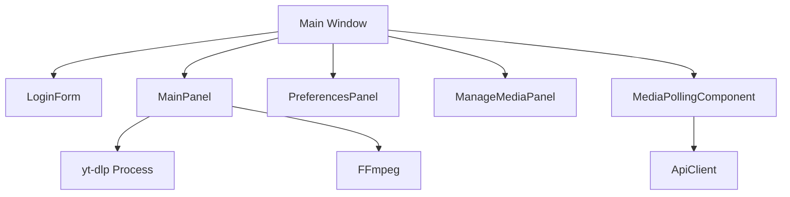

## Application Structure

MegaDownloader is a Java Swing desktop application that provides a graphical interface for downloading videos and audio from YouTube using yt-dlp. The application follows a panel-based navigation pattern using CardLayout to switch between different screens.

### Core Architecture

The application is structured around a main window (`Main.java`) that manages multiple panels:



<Note>
The application uses an **undecorated frame** (no native title bar) and implements custom window dragging functionality through mouse listeners.
</Note>

## Technology Stack

### UI Framework

<CardGroup cols={2}>
  <Card title="Java Swing" icon="coffee">
    Core GUI framework for building the desktop interface
  </Card>
  
  <Card title="FlatLaf Darcula" icon="moon">
    Modern dark theme for enhanced visual appearance
  </Card>
</CardGroup>

### External Tools

<CardGroup cols={2}>
  <Card title="yt-dlp" icon="download">
    Command-line tool for downloading videos from YouTube and other platforms
  </Card>
  
  <Card title="FFmpeg" icon="file-audio">
    Media processing for audio extraction and format conversion
  </Card>
</CardGroup>

### Key Technologies

- **Java Swing**: GUI components (JFrame, JPanel, CardLayout)
- **FlatLaf Darcula**: Dark theme (`FlatDarculaLaf.setup()`)
- **yt-dlp**: External process for media downloads
- **FFmpeg**: Audio/video processing (auto-detected or manually configured)
- **Java Preferences API**: Persistent storage for user credentials
- **SwingWorker**: Background task execution without blocking the UI

## Design Patterns

### 1. CardLayout Navigation Pattern

The application uses CardLayout to manage multiple panels within a single window:

```java
cardLayout = new java.awt.CardLayout();
cardPanel = new javax.swing.JPanel(cardLayout);
cardPanel.add(mainPanel, "MAIN");
cardPanel.add(preferencesPanel, "PREFERENCES");
cardPanel.add(manageMediaPanel, "MEDIA");
cardPanel.add(loginForm, "LOGIN");
```

Navigation between panels is handled by the `Main` class with methods like:
- `showMainPanel()`
- `showPreferencesPanel()`
- `showManageMediaPanel()`
- `showLoginForm()`
- `goBack()`

### 2. Dependency Injection

Panels are connected through setter-based dependency injection:

```java
// Main.java
loginForm.setMediaPollingComponent(mediaPollingComponent);
manageMediaPanel.setMediaPollingComponent(mediaPollingComponent);
mainPanel.setPreferencesPanel(preferencesPanel);
mainPanel.setMainFrame(this);
```

### 3. Observer Pattern

The `MediaPollingComponent` uses listeners to notify panels of new media:

```java
// ManageMediaPanel.java
mediaPollingComponent.addMediaPollingListener(newMedia -> {
    SwingUtilities.invokeLater(() -> {
        mediaFromServer.addAll(newMedia);
        addNewMediaToTable(newMedia);
    });
});
```

### 4. SwingWorker Pattern

Long-running operations use SwingWorker to avoid blocking the UI thread:

```java
SwingWorker<Integer, Integer> worker = new SwingWorker<Integer, Integer>() {
    @Override
    protected Integer doInBackground() throws Exception {
        // Execute yt-dlp process
        return process.waitFor();
    }
    
    @Override
    protected void done() {
        // Update UI on EDT
    }
};
worker.execute();
```

## Layered Layout

The application uses `JLayeredPane` to overlay components:

```java
JLayeredPane layeredPane = new JLayeredPane();
cardPanel.setBounds(0, 0, 800, 600);
layeredPane.add(cardPanel, JLayeredPane.DEFAULT_LAYER);
mediaPollingComponent.setBounds(10, 10, 200, 80);
layeredPane.add(mediaPollingComponent, JLayeredPane.PALETTE_LAYER);
layeredPane.add(btnExit, JLayeredPane.POPUP_LAYER);
```

**Layer hierarchy** (bottom to top):
1. `DEFAULT_LAYER` - Main content panels
2. `PALETTE_LAYER` - Media polling status indicator
3. `POPUP_LAYER` - Exit button

## Configuration Management

The application stores configuration in a local `config.txt` file:

```
path:"C:\\path\\to\\yt-dlp.exe"
downloadDir:"C:\\Users\\Username\\Downloads"
ffmpegPath:"C:\\path\\to\\ffmpeg"
```

<Info>
User credentials are stored separately using the Java Preferences API for secure session management.
</Info>

## Process Execution

The application executes external processes (yt-dlp) and parses their output in real-time:

```java
ProcessBuilder pb = new ProcessBuilder(command);
pb.redirectErrorStream(true);
Process process = pb.start();

try (BufferedReader reader = new BufferedReader(
        new InputStreamReader(process.getInputStream()))) {
    String line;
    while ((line = reader.readLine()) != null) {
        // Parse progress and update UI
        if (line.contains("[download]") && line.contains("%")) {
            // Extract percentage and update progress bar
        }
    }
}
```

## Next Steps

<CardGroup cols={2}>
  <Card title="Core Components" href="/architecture/components">
    Detailed overview of each component and its responsibilities
  </Card>
  
  <Card title="UI Panels" href="/architecture/ui-panels">
    Panel navigation flow and UI implementation details
  </Card>
</CardGroup>