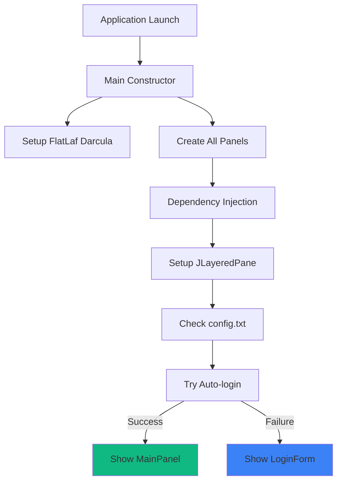
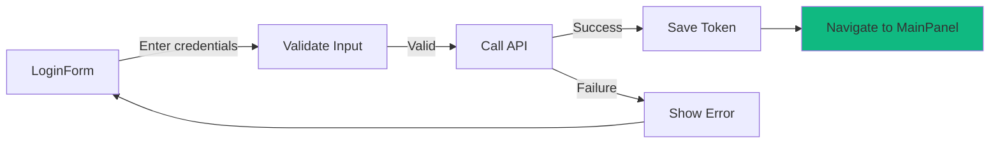
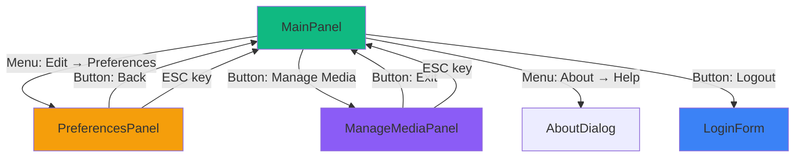

## Panel Navigation System

MegaDownloader uses Java Swing's **CardLayout** to implement single-window navigation between multiple panels. This approach provides a seamless user experience without opening multiple windows.

### CardLayout Implementation

**Location**: `Main.java:72-78`

```java
// Setup CardLayout
cardLayout = new java.awt.CardLayout();
cardPanel = new javax.swing.JPanel(cardLayout);
cardPanel.add(mainPanel, "MAIN");
cardPanel.add(preferencesPanel, "PREFERENCES");
cardPanel.add(manageMediaPanel, "MEDIA");
cardPanel.add(loginForm, "LOGIN");
```

<Note>
Each panel is registered with a string identifier that's used for navigation.
</Note>

### Navigation State Management

The `Main` class tracks navigation state to enable back button functionality:

```java
private String currentPanel = "LOGIN";
private String previousPanel = "LOGIN";

public void showMainPanel() {
    previousPanel = currentPanel;
    currentPanel = "MAIN";
    cardLayout.show(cardPanel, "MAIN");
}

public void goBack() {
    cardLayout.show(cardPanel, previousPanel);
    currentPanel = previousPanel;
}
```

---

## Navigation Flow

### Application Start Flow



**Code**: `Main.java:109-119`

```java
// Check if config.txt exists on startup
checkConfig();

// Try auto-login
if (loginForm.checkAutoLogin()) {
    currentPanel = "MAIN";
    cardLayout.show(cardPanel, "MAIN");
} else {
    currentPanel = "LOGIN";
    cardLayout.show(cardPanel, "LOGIN");
}
```

### Login to Main Flow



**Code**: `LoginForm.java:194-245`

### Navigation Between Panels



---

## LoginForm Panel

### UI Layout

**Location**: `LoginForm.java:73-152`

<Tabs>
  <Tab title="Components">
    - Email text field with validation
    - Password field
    - "Remember me" checkbox
    - Login button
    - Banner image
  </Tab>
  
  <Tab title="Layout">
    Uses BoxLayout with CENTER alignment:
    ```java
    JPanel formPanel = new JPanel();
    formPanel.setLayout(new BoxLayout(formPanel, BoxLayout.Y_AXIS));
    formPanel.add(lblPhotoBanner);
    formPanel.add(lblEmail);
    formPanel.add(txtEmail);
    formPanel.add(lblPassword);
    formPanel.add(txtPassword);
    formPanel.add(tglRemember);
    formPanel.add(btnLogin);
    ```
  </Tab>
  
  <Tab title="Keyboard Shortcuts">
    - **ENTER**: Submit login form
    - **ESC**: Exit application
  </Tab>
</Tabs>

### Real-time Email Validation

**Location**: `LoginForm.java:96-113`

```java
txtEmail.getDocument().addDocumentListener(new DocumentListener() {
    @Override
    public void insertUpdate(DocumentEvent e) {
        validateEmail();
    }
    // ... other methods
});

private boolean validateEmail() {
    String email = txtEmail.getText();
    Pattern pattern = Pattern.compile("^[\\w.-]+@[\\w.-]+\\.[a-zA-Z]{2,}$");
    if (!pattern.matcher(email).matches()) {
        txtEmail.setBorder(BorderFactory.createLineBorder(new Color(220, 53, 69)));
        return false;
    }
    txtEmail.setBorder(defaultBorder);
    return true;
}
```

<Info>
The email field shows a **red border** when the input doesn't match the email pattern.
</Info>

### Session Persistence

Credentials are stored using Java Preferences API:

```java
prefs = Preferences.userNodeForPackage(LoginForm.class);

// Save on successful login
if (tglRemember.isSelected()) {
    prefs.put("auth_token", token);
    prefs.put("user_email", email);
}

// Auto-login on startup
public boolean checkAutoLogin() {
    String savedToken = prefs.get("auth_token", null);
    if (savedToken != null && mediaPollingComponent.checkToken(savedToken)) {
        return true;
    }
    return false;
}
```

---

## MainPanel - Download Interface

### UI Layout

**Location**: `MainPanel.java:331-469`

<CardGroup cols={2}>
  <Card title="Main Components">
    - URL input field
    - Download button
    - Audio-only checkbox
    - Progress bar (hidden initially)
    - Play button (appears after download)
  </Card>
  
  <Card title="Additional Features">
    - Advanced options toggle
    - Custom arguments text area
    - Manage Media button
    - GitHub logo (clickable link)
    - Logout button
  </Card>
</CardGroup>

### Advanced Options Toggle

**Location**: `MainPanel.java:785-796`

```java
private void tglAdvancedOptionsActionPerformed(java.awt.event.ActionEvent evt) {
    boolean isSelected = tglAdvancedOptions.isSelected();
    jScrollPane1.setVisible(isSelected);
    txtAreaCustomArgs.setVisible(isSelected);
    lblCustomArgs.setVisible(isSelected);
    
    if (isSelected) {
        tglAdvancedOptions.setText("Advanced ▲");
    } else {
        tglAdvancedOptions.setText("Advanced ▼");
    }
}
```

<Accordion title="Custom Arguments Example">
Users can add custom yt-dlp arguments like:
```
--format best
--write-thumbnail
--embed-metadata
```

These are parsed and added to the yt-dlp command:
```java
String[] args = customArgs.split("\\s+(?=(?:[^\"]*\"[^\"]*\")*[^\"]*$)");
for (String arg : args) {
    command.add(arg);
}
```
</Accordion>

### Download Progress Indicator

**Location**: `MainPanel.java:540-544`

```java
downloadBtn.setEnabled(false);
downloadBtn.setText("Downloading...");
progressBar.setValue(0);
progressBar.setVisible(true);
```

Progress is parsed from yt-dlp output:

```java
if (line.contains("[download]") && line.contains("%")) {
    String percentStr = line.substring(
        line.indexOf("]") + 1, line.indexOf("%")).trim();
    double percent = Double.parseDouble(percentStr);
    publish((int) percent);
}
```

### Keyboard Shortcuts

**Location**: `MainPanel.java:158-168`

- **ESC**: Exit application immediately

---

## ManageMediaPanel - Media Library

### UI Layout

**Location**: `ManageMediaPanel.java:694-750`

<Tabs>
  <Tab title="Table Columns">
    1. **Status** - Sync indicator (✓ for both, empty for local/server only)
    2. **File Name** - Media filename
    3. **Type** - Video/Audio/Other
    4. **Size** - Formatted file size (KB/MB/GB)
    5. **Date Modified** - Last modification date
    6. **Source** - Local/Server/Both
  </Tab>
  
  <Tab title="Controls">
    - Text filter field (real-time search)
    - Type filter combo box (All/Video/Audio)
    - Quick Actions list
    - Exit button
  </Tab>
  
  <Tab title="Quick Actions">
    1. **Play** - Open file with default player
    2. **Open Folder** - Open download directory
    3. **Download** - Download from server
    4. **Delete** - Remove local file
  </Tab>
</Tabs>

### Sortable Table

```java
tblFiles.setAutoCreateRowSorter(true);
```

<Note>
Users can click column headers to sort the table by any column.
</Note>

### Context Menu

**Location**: `ManageMediaPanel.java:309-347`

```java
tableContextMenu = new JPopupMenu();
JMenuItem playItem = new JMenuItem("Play");
JMenuItem openFolderItem = new JMenuItem("Open Folder");
JMenuItem downloadItem = new JMenuItem("Download");
JMenuItem deleteItem = new JMenuItem("Delete");

tblFiles.addMouseListener(new MouseAdapter() {
    @Override
    public void mouseReleased(MouseEvent e) {
        if (e.isPopupTrigger()) {
            int row = tblFiles.rowAtPoint(e.getPoint());
            tblFiles.setRowSelectionInterval(row, row);
            tableContextMenu.show(e.getComponent(), e.getX(), e.getY());
        }
    }
});
```

### Real-time Text Filter

**Location**: `ManageMediaPanel.java:284-307`

```java
fieldFilter.getDocument().addDocumentListener(new DocumentListener() {
    private void updateTextFilter() {
        textFilter = fieldFilter.getText().toLowerCase().trim();
        loadMediaFiles(); // Refresh table
    }
});
```

Filters both local and server files:

```java
if (textFilter.isEmpty() || 
    media.getFileName().toLowerCase().contains(textFilter)) {
    // Add to table
}
```

### Refresh on Panel Show

**Location**: `ManageMediaPanel.java:272-279`

```java
addComponentListener(new ComponentAdapter() {
    @Override
    public void componentShown(ComponentEvent e) {
        loadMediaFiles();
    }
});
```

<Info>
The media table automatically refreshes every time the panel is displayed.
</Info>

---

## PreferencesPanel - Settings

### UI Layout

**Location**: `PreferencesPanel.java:176-317`

<CardGroup cols={2}>
  <Card title="Path Configuration">
    - yt-dlp location with file chooser
    - Download directory selection
    - Current paths display
  </Card>
  
  <Card title="Download Options">
    - Speed limiter toggle and slider
    - Speed text field (manual input)
    - M3U playlist generation checkbox
  </Card>
</CardGroup>

### Speed Limiter Controls

**Location**: `PreferencesPanel.java:70-123`

The slider and text field are synchronized:

```java
// Slider updates text field
sliderLimiter.addChangeListener(new ChangeListener() {
    @Override
    public void stateChanged(ChangeEvent e) {
        speedLimitKBps = sliderLimiter.getValue();
        txtLimiter.setText(speedLimitKBps + " KB/s");
    }
});

// Text field updates slider
txtLimiter.getDocument().addDocumentListener(new DocumentListener() {
    private void updateSliderFromText() {
        String text = txtLimiter.getText().replaceAll("[^0-9]", "");
        int value = Math.max(1, Math.min(100000, Integer.parseInt(text)));
        sliderLimiter.setValue(value);
    }
});
```

**Range**: 1 KB/s to 100,000 KB/s (100 MB/s)

### File Choosers

**yt-dlp Executable** (`PreferencesPanel.java:327`):

```java
JFileChooser fileChooser = new JFileChooser();
fileChooser.setDialogTitle("Select yt-dlp executable");
fileChooser.setFileSelectionMode(JFileChooser.FILES_ONLY);
FileNameExtensionFilter filter = new FileNameExtensionFilter("Executable", "exe");
fileChooser.setFileFilter(filter);
```

**Download Directory** (`PreferencesPanel.java:372`):

```java
JFileChooser fileChooser = new JFileChooser();
fileChooser.setDialogTitle("Select download directory");
fileChooser.setFileSelectionMode(JFileChooser.DIRECTORIES_ONLY);
```

---

## Window Dragging

Since the application uses an **undecorated frame** (no title bar), custom dragging is implemented:

### Implementation

**Location**: `Main.java:139-164`

```java
private Point initialClick;

private void enableDragging(Component component) {
    component.addMouseListener(new MouseAdapter() {
        @Override
        public void mousePressed(MouseEvent e) {
            initialClick = e.getPoint();
        }
    });

    component.addMouseMotionListener(new MouseMotionAdapter() {
        @Override
        public void mouseDragged(MouseEvent e) {
            int thisX = Main.this.getLocation().x;
            int thisY = Main.this.getLocation().y;
            int xMoved = e.getX() - initialClick.x;
            int yMoved = e.getY() - initialClick.y;
            Main.this.setLocation(thisX + xMoved, thisY + yMoved);
        }
    });
}
```

### Applied To

```java
enableDragging(getContentPane());
enableDragging(jMenuBar1);
enableDragging(mediaPollingComponent);
```

<Note>
Users can drag the window by clicking on the content pane, menu bar, or media polling component.
</Note>

---

## FlatLaf Darcula Theme

### Theme Setup

**Location**: `Main.java:50`

```java
public Main() {
    FlatDarculaLaf.setup();
    setUndecorated(true);
    initComponents();
    // ...
}
```

<Info>
**FlatLaf Darcula** provides a modern, dark look and feel that's automatically applied to all Swing components.
</Info>

### Key Visual Features

- Dark background color scheme
- Modern button styling
- Flat design aesthetic
- Improved contrast and readability
- Custom component rendering

---

## Exit Button in Layered Pane

The exit button is placed in the top layer using JLayeredPane:

**Location**: `Main.java:87`

```java
layeredPane.add(btnExit, JLayeredPane.POPUP_LAYER);
btnExit.setBounds(770, 2, 26, 26);
```

This ensures the exit button is always visible regardless of which panel is active.

### Exit Button Handler

**Location**: `Main.java:268-270`

```java
private void btnExitActionPerformed(java.awt.event.ActionEvent evt) {
    System.exit(0);
}
```

---

## Navigation Summary

### Panel Transitions

<CardGroup cols={2}>
  <Card title="From LoginForm">
    → MainPanel (on successful login)
  </Card>
  
  <Card title="From MainPanel">
    → PreferencesPanel (menu)
    → ManageMediaPanel (button)
    → LoginForm (logout)
  </Card>
  
  <Card title="From PreferencesPanel">
    → Previous panel (back button or ESC)
  </Card>
  
  <Card title="From ManageMediaPanel">
    → MainPanel (exit button or ESC)
  </Card>
</CardGroup>

### Keyboard Navigation

- **ESC** on LoginForm: Exit application
- **ENTER** on LoginForm: Submit login
- **ESC** on MainPanel: Exit application
- **ESC** on PreferencesPanel: Go back to previous panel
- **ESC** on ManageMediaPanel: Return to MainPanel

<Note>
Keyboard shortcuts are implemented using `InputMap` and `ActionMap` with `JComponent.WHEN_IN_FOCUSED_WINDOW` scope.
</Note>